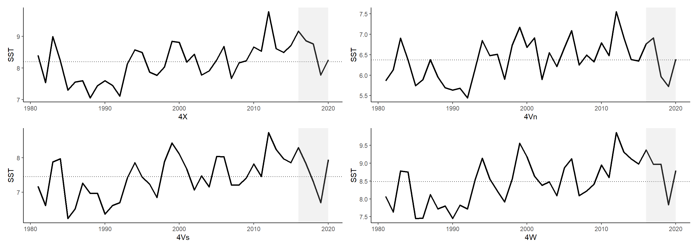

# Sea Surface Temperature {#SST}

**Description**: 

**Ecosystem Based Management Pillar**:

  - Pressure and Stressors
  
**Sub-attribute**:  

  - Climate and Oceanography

**Data collection**: [Casault et al. 2024](https://publications.gc.ca/collections/collection_2024/mpo-dfo/Fs97-6-3589-eng.pdf) 

## Introduction to the indicator

### NAFO Division trends


<div class="figure" style="text-align: center">

<p class="caption">(\#fig:nafo4xSSTBT)Sea Surface Temperature and Bottom temperature from fixed stations for 4X. Dotted lines denote the long-term mean.</p>
</div>

## How to access the data


```r

azmpdata::Derived_Annual_Broadscale |>
  dplyr::select(year, sea_surface_temperature_from_satellite)

```
